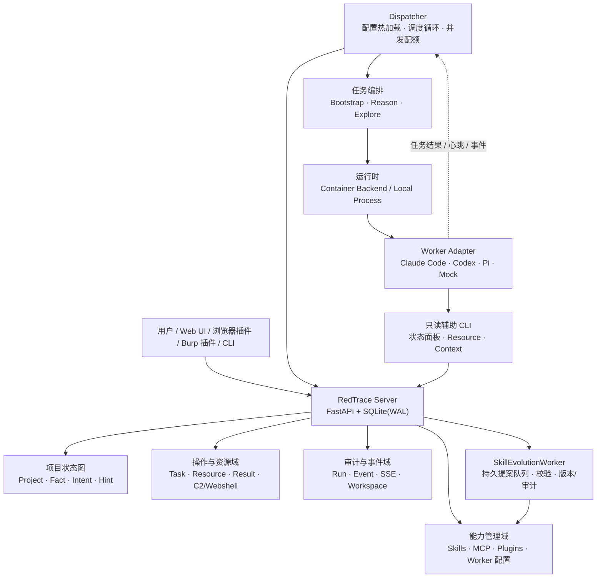

# RedTrace

RedTrace 是一个面向通用问题求解的**状态空间协作引擎**。它把“从当前已知信息走到目标状态”的过程建模为可追溯的事实图，并由 Dispatcher 将探索任务分配给多个 Agent Worker 并行执行。

项目不要求预先定义固定角色或僵化工作流：用户提供项目目标、初始事实和约束，Agent 通过读取共享状态、声明探索意图、验证结果并写回新事实，逐步扩大可达路径。人类可以随时注入 Hint，系统则保留每次任务、工具调用、产出和状态变化的审计记录。

RedTrace 适合用于：

- 已授权的渗透测试、安全评估和漏洞验证；
- CTF、靶场和本地沙箱中的逆向工程；
- 多 Agent 协作的资料研究、故障排查和复杂工程探索；
- 需要并行尝试、证据沉淀和可恢复执行的长任务。

> 安全边界：安全相关能力仅限于明确授权的环境。RedTrace 不为未授权访问、破坏或绕过安全控制提供使用授权。

## 项目定位

RedTrace 解决的是“如何让多个异构 Agent 在一个可验证、可恢复、可审计的探索过程中协作”这一基础问题，而不是单一领域的聊天机器人或脚本集合。

核心设计取舍如下：

1. **事实图优先**：把已确认信息、待探索方向和人工判断分开建模，避免把临时对话误当成结论。
2. **控制面与执行面分离**：Server 维护状态和协议一致性；Dispatcher 负责调度与生命周期；Worker 只专注于完成当前任务。
3. **异构 Worker 原生接入**：Claude Code、Codex、Pi 和 Mock 通过统一适配器运行，同时保留各自 CLI 的原生能力。
4. **按需读取、异步演进**：Worker 可以通过只读状态面板 CLI 和资源 CLI 获取有限上下文；Skill 演进进入持久队列，由低优先级后台线程处理，不阻塞任务执行。
5. **证据和审计可回放**：任务输出、工具事件、心跳、取消、资源操作和 Skill 变更均可查询、导出和追踪。

## 完整架构设计



### 1. Server：状态与协议控制面

Server 是 FastAPI 应用，启动时初始化 SQLite 数据库、恢复未完成任务，并启动 Skill 演进后台 Worker。它不负责直接运行模型进程，而是提供一致的读写协议和 Web 控制台。

- **项目状态图**：保存 Project、Fact、Intent、Hint；Fact 采用追加式记录，Intent 支持声明、认领、heartbeat、release、结论和完成。
- **项目生命周期**：Project 状态为 `active`、`stopped` 或 `completed`；支持暂停、恢复、标题修改和 Reason 租约。
- **操作与资源**：管理资源元数据、任务、结果和操作状态；支持插件动作、Webshell 配置/探测/执行，以及 C2 payload 辅助生成。
- **Worker 配置**：在设置页面创建、编辑、复制、启停和删除 Worker；使用 revision 做乐观并发控制，保存前可执行配置校验和连接测试。
- **能力管理**：统一管理 Skills、MCP 和外部插件的启用状态、版本、回滚和审计。
- **审计与事件**：按项目、任务和运行实例组织事件，提供分页查询、SSE 实时流、Workspace 文件浏览和导出。
- **状态面板只读协议**：提供状态、变更、节点、路径和局部上下文查询；查询本身写入审计，但不会改变事实图。

数据库默认使用 SQLite WAL。事实图写入与修订事件在同一事务内完成，保证多个 Dispatcher/Worker 并发读取时仍能获得单调递增的状态修订。

### 2. Dispatcher：调度与生命周期控制面

Dispatcher 是独立运行的客户端执行器，也是协议写入的唯一入口。它按轮次读取项目摘要和 Worker 配额，完成任务选择、认领、执行、回收和重试。

- **配置**：读取 `dispatch.yaml`，支持容器模式和本地模式；文件原子替换后增量热加载，新任务使用新快照，运行中任务继续使用旧快照。
- **调度**：按项目状态、Bootstrap 开关、Intent 可用性、Worker 类型、优先级、`max_running` 和项目并发上限选择任务。
- **任务编排**：
  - `bootstrap`：项目初始阶段的直接推进尝试，可在执行失败或超时后进入 conclude fallback；
  - `reason`：读取全图，判断目标是否达成，并产生 Complete、Intent 或“暂无下一步”；
  - `explore`：认领一个 Intent，执行探索并提交一个 Fact 结论。
- **运行治理**：启动健康检查、任务超时、进程取消、容器清理、Intent/Reason heartbeat、失联回收和状态变化优先的结构化日志。
- **输出契约**：Prompt 按组以 Markdown 分发；解析器从 Worker 输出提取 JSON，并对三类任务分别执行 schema 校验。

### 3. Runtime 与 Worker：隔离执行面

Runtime 为每个任务提供可控的执行环境：

- **Container Backend**：适合 Docker/Compose 部署，按项目管理容器、Workspace 和清理流程；
- **Local Backend**：直接调用宿主机上的 `claude`、`codex`、`pi`，复用用户级登录和原生扩展；
- **进程治理**：统一处理 stdout/stderr 流、心跳、超时、取消、退出码和输出截断。

Worker Adapter 将不同 Agent CLI 归一为统一接口，同时保留原生配置：

| Worker | 适配器 | 适用场景 |
|---|---|---|
| Claude Code | `claudecode` | 代码库分析、工具调用和长任务执行 |
| Codex | `codex` | OpenAI 模型驱动的工程任务 |
| Pi | `pi` | 轻量、可扩展的 Agent CLI |
| Mock | `mock` | 协议测试、调度测试和端到端回归 |

设置页面中的 Endpoint、API Key 和 Model ID 可按 Worker 覆盖运行参数；空值时回退到原生 CLI 配置。Claude/Pi 的网关密钥写入原生 JSON，Codex 密钥由 RedTrace 加密保存并按进程注入 `OPENAI_API_KEY`。

### 4. 能力与 Skill 演进面

仓库根目录的 `skills/` 是 Claude Code、Codex 和 Pi 共用的唯一 Skill 源；`mcp/` 保存共用 MCP 配置，运行时再转换为各 Agent 的原生格式；`plugins/manifest.json` 是浏览器、Burp 等外部插件的统一注册表。

`CapabilityStore` 负责能力的发现、启停、版本、SHA-256 revision、历史、锁和审计。`SkillEvolutionEngine` 只接受完整的 `SKILL.md` 替换提案，并要求：

- 提供 1–8 条具体验证结果；
- 任务确实成功，且量化节省的工具调用、无效步骤或执行时间；
- 拒绝重复内容、单纯追加、过度增长和过期 revision；
- 优先匹配并更新已有 Skill，只有在容量允许且没有可复用 Skill 时才新建；
- 对冗余 Skill 做合并/退役，并保留版本和回滚记录。

提案写入持久 inbox 后由 `SkillEvolutionWorker` 异步处理，不在任务执行路径中额外调用模型。

### 5. 辅助 CLI 与上下文面

为避免把完整历史无边界地塞进 Prompt，项目提供三个按需工具：

- `redtrace-blackboard`：状态面板只读 CLI，支持 `status`、`changes`、`node`、`path`、`context`；该入口名为历史兼容名称；
- `redtrace-resource`：列出/读取资源，按声明动作排队执行操作，敏感值始终留在 Server 侧；
- `redtrace-context`：对任务 Workspace 中的文件做有预算的摘要、类型识别、信号提取和增量快照。

Context Harness 输出固定的 JSON/JSONL 工件和摘要引用，支持跨任务复用、内存/耗时统计以及大型文件的边界读取。

## 主要功能设计

### 事实图协议

| 对象 | 作用 | 关键约束 |
|---|---|---|
| `Project` | 目标、状态和调度边界 | `active` / `stopped` / `completed` |
| `Fact` | 已验证的客观发现 | 追加式写入，不原地修改 |
| `Intent` | 从一个或多个 Fact 出发的探索方向 | `open` → `claimed` → `concluded`，支持 heartbeat/release |
| `Hint` | 人类注入的判断、限制或优先级 | 可随时追加，读取时进入上下文 |

`from` 支持多个 Fact，因此可以表达“多个前置事实共同支撑一次探索”的超边语义。服务端负责认领冲突、幂等校验和状态修订；Worker 只通过 Dispatcher 间接写入。

### 任务状态机

```text
项目创建
  └─> bootstrap（可选）
        └─> reason：判断是否完成 / 生成 Intent
              └─> explore：并行探索 Intent
                    └─> 写入 Fact + Intent 结论
                          └─> 下一轮 reason，直到 completed 或 stopped
```

每次任务都绑定项目、Worker、运行实例和 Workspace。超时、取消、进程异常和服务重启后，Dispatcher 会根据服务端状态进行恢复或安全回收。

### Web 控制台与外部插件

- 图视图展示 Fact/Intent/Hint 的关系、路径和局部上下文；
- 操作面板展示任务、运行、事件、工具调用、资源和 Workspace 文件；
- SSE 让日志和状态更新实时到达浏览器；
- 能力页面管理 Skill/MCP/Plugin，设置页面管理 Worker；
- 浏览器扩展和 Burp Suite 扩展可提交流量分析任务，统一连接 `/api/plugins/v1`；
- 为兼容旧客户端，保留历史 `/api/auth/*`、`/api/projects`、`/api/*-agent/stream` 和取消接口。

外部插件默认连接 `http://127.0.0.1:8000`。若 Server 绑定非回环地址，应配置 `REDTRACE_PLUGIN_TOKEN`，并在插件中使用同一令牌。完整契约见 [`docs/specs/plugin-compatibility.md`](docs/specs/plugin-compatibility.md)。

## 仓库结构

| 路径 | 内容 |
|---|---|
| `redtrace/src/redtrace/server/` | FastAPI 应用、SQLite、协议模型、路由、审计和静态 Web UI |
| `redtrace/src/redtrace/dispatcher/` | 配置、调度循环、任务、Prompt、运行时和 Worker 适配器 |
| `redtrace/src/redtrace/capabilities.py` | Skill/MCP 能力仓库、版本和审计 |
| `redtrace/src/redtrace/skill_evolution.py` | Skill 提案校验、异步演进和回滚链 |
| `redtrace/src/redtrace/worker_config.py` | Worker 配置、连接测试和本地 CLI 同步 |
| `redtrace/src/redtrace/*_cli.py` | 状态面板、资源、上下文和 Skill 命令行工具 |
| `skills/` | Claude Code、Codex、Pi 共用的 Skill 源 |
| `mcp/` | 共用 MCP 配置 |
| `plugins/` | 插件注册表及浏览器/Burp 插件源码 |
| `docs/specs/` | Server 协议、Dispatcher、插件兼容和 Skill 演进规范 |
| `dispatch*.yaml` | 容器、本地和 Mock 调度配置示例 |

## 快速开始

### 环境要求

- Python ≥ 3.12
- Docker（仅容器模式需要）
- `uv`（推荐用于安装和运行 Python 项目）

### Windows WSL + Kali root（默认）

默认部署目标是 Windows WSL 中以 root 运行的 Kali。WSL 已作为外层隔离边界，
因此 Claude Code、Codex 和 Pi 默认不再启用各自的沙盒或交互审批。Claude Code
和 Codex 优先使用原生 WebFetch/WebSearch，失败或不可用时再使用共享
`brave-search` Skill；Pi 直接使用该 Skill。

```bash
git clone https://github.com/0X6C7879/RedTrace.git
cd RedTrace
BRAVE_API_KEY="replace-me" bash deploy-local.sh
```

部署脚本会安装依赖、同步原生 CLI 配置并加密保存 Brave API Key。默认模型上下文
按 1,000,000 tokens 配置，并在约 90% 时进行自动压缩；Bootstrap 和 Explore
各有 30 分钟主阶段与 5 分钟收尾，Reason 为 5 分钟，健康检查为 60 秒。

### Docker Compose

```bash
cp dispatch.example.yaml dispatch.yaml
docker compose up --build
```

启动后访问 `http://127.0.0.1:8000`，在“设置”页面维护 Worker、Skills 和 MCP。Dispatcher 会使用配置快照执行任务。

### 本地模式（无需 Docker）

本地模式直接调用宿主机已安装的 `claude`、`codex` 和 `pi`：

```bash
cp dispatch.local.example.yaml dispatch.local.yaml
REDTRACE_DISPATCH_CONFIG="$PWD/dispatch.local.yaml" uv run --project redtrace redtrace serve
uv run --project redtrace redtrace dispatch --config dispatch.local.yaml
```

其他 Ubuntu/Kali 环境也可使用一键脚本准备 CLI、RTK、项目依赖和安全相关
Skills；脚本会提示它不是默认的 WSL root 部署，但仍可继续：

```bash
bash deploy-local.sh
```

### 常用 CLI

```bash
# 只读查询状态面板（入口名保留兼容）
redtrace-blackboard status
redtrace-blackboard changes --since 42 --limit 20
redtrace-blackboard context f003 --depth 1 --limit 30

# 读取共享资源或排队资源动作
redtrace-resource capabilities
redtrace-resource list
redtrace-resource tasks

# 提交一份带验证证据的 Skill 演进提案
redtrace-skill propose \
  --name my-skill \
  --candidate skills/my-skill/SKILL.md \
  --summary "压缩重复步骤并减少无效工具调用" \
  --validated "pytest -q redtrace/tests/test_skill_evolution.py" \
  --tool-calls-saved 2
```

### 测试

```bash
uv run --project redtrace --group dev pytest
```

## 设计规范

- [`docs/specs/server-protocol.md`](docs/specs/server-protocol.md)：事实图、Project/Fact/Intent/Hint 和 API 协议；
- [`docs/specs/dispatcher-design.md`](docs/specs/dispatcher-design.md)：调度、任务状态机、Worker 与运行时；
- [`docs/specs/context-harness.md`](docs/specs/context-harness.md)：有预算的上下文摘要和增量工件；
- [`docs/specs/skill-evolution.md`](docs/specs/skill-evolution.md)：统一 Skill 源、提案门槛、版本和回滚；
- [`docs/specs/plugin-compatibility.md`](docs/specs/plugin-compatibility.md)：外部插件 API 与迁移兼容；
- [`docs/shared-blackboard-cli.md`](docs/shared-blackboard-cli.md)：状态面板只读 CLI 与服务端查询协议。

## 许可证

本项目基于 **GNU AGPLv3** 许可。商业使用请联系项目维护者获取商业授权。
