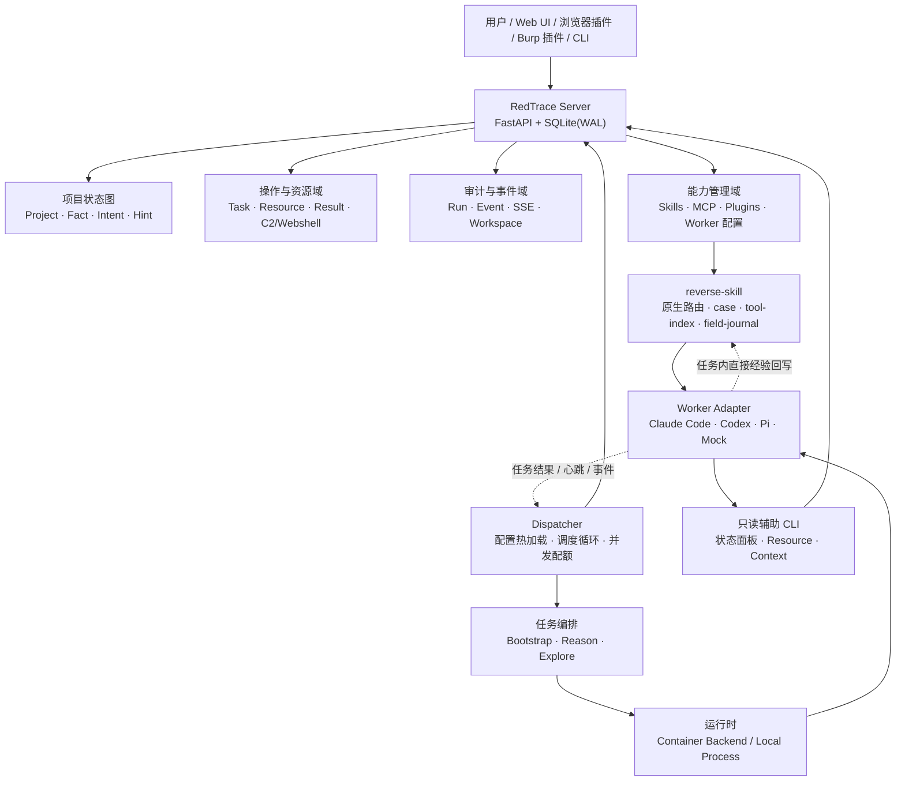

# RedTrace

RedTrace 是一个面向通用问题求解的**状态空间协作引擎**。它把“从当前已知信息走到目标状态”的过程建模为可追溯的事实图，并由 Dispatcher 将探索任务分配给多个 Agent Worker 并行执行。

项目不要求预先定义固定角色或僵化工作流：用户提供项目目标、初始事实和约束，Agent 通过读取共享状态、声明探索意图、验证结果并写回新事实，逐步扩大可达路径。人类可以随时注入 Hint，系统则保留每次任务、工具调用、产出和状态变化的审计记录。

RedTrace 适合用于：

- 已授权的渗透测试、安全评估和漏洞验证；
- CTF、靶场和本地沙箱中的逆向工程；
- 多 Agent 协作的资料研究、故障排查和复杂工程探索；
- 需要并行尝试、证据沉淀和可恢复执行的长任务。

> 安全边界：安全相关能力仅限于明确授权的环境。RedTrace 不为未授权访问、破坏或绕过安全控制提供使用授权。

## 项目定位

RedTrace 解决的是“如何让多个异构 Agent 在一个可验证、可恢复、可审计的探索过程中协作”这一基础问题，而不是单一领域的聊天机器人或脚本集合。

核心设计取舍如下：

1. **事实图优先**：把已确认信息、待探索方向和人工判断分开建模，避免把临时对话误当成结论。
2. **控制面与执行面分离**：Server 维护状态和协议一致性；Dispatcher 负责调度与生命周期；Worker 只专注于完成当前任务。
3. **异构 Worker 原生接入**：Claude Code、Codex、Pi 和 Mock 通过统一适配器运行，同时保留各自 CLI 的原生能力。
4. **按需读取、原生回写**：安全能力统一由 reverse-skill 路由；Worker 在原任务中直接完成脱敏 field-journal 回写，不经过额外模型、队列或治理线程。
5. **证据和审计可回放**：任务输出、工具事件、心跳、取消和资源操作均可查询、导出和追踪。

## 完整架构设计



### 1. Server：状态与协议控制面

Server 是 FastAPI 应用，启动时初始化 SQLite 数据库并恢复未完成任务。它不负责直接运行模型进程，也不参与 Skill 自我进化，只提供一致的读写协议和 Web 控制台。

- **项目状态图**：保存 Project、Fact、Intent、Hint；Fact 采用追加式记录，Intent 支持声明、认领、heartbeat、release、结论和完成。
- **项目生命周期**：Project 状态为 `active`、`stopped` 或 `completed`；支持暂停、恢复、标题修改和 Reason 租约。
- **操作与资源**：管理资源元数据、任务、结果和操作状态；支持插件动作、Webshell 配置/探测/执行，以及 C2 payload 辅助生成。
- **Worker 配置**：在设置页面创建、编辑、复制、启停和删除 Worker；使用 revision 做乐观并发控制，保存前可执行配置校验和连接测试。
- **能力管理**：统一管理 Skills、MCP 和外部插件的启用状态、版本、回滚和审计。
- **审计与事件**：按项目、任务和运行实例组织事件，提供分页查询、SSE 实时流、Workspace 文件浏览和导出。
- **状态面板只读协议**：提供状态、变更、节点、路径和局部上下文查询；查询本身写入审计，但不会改变事实图。

数据库默认使用 SQLite WAL。事实图写入与修订事件在同一事务内完成，保证多个 Dispatcher/Worker 并发读取时仍能获得单调递增的状态修订。

### 2. Dispatcher：调度与生命周期控制面

Dispatcher 是独立运行的客户端执行器，也是协议写入的唯一入口。它按轮次读取项目摘要和 Worker 配额，完成任务选择、认领、执行、回收和重试。

- **配置**：读取 `dispatch.yaml`，支持容器模式和本地模式；文件原子替换后增量热加载，新任务使用新快照，运行中任务继续使用旧快照。
- **调度**：按项目状态、Bootstrap 开关、Intent 可用性、Worker 类型、优先级、`max_running` 和项目并发上限选择任务。
- **任务编排**：
  - `bootstrap`：项目初始阶段的直接推进尝试，可在执行失败或超时后进入 conclude fallback；
  - `reason`：读取全图，判断目标是否达成，并产生 Complete、Intent 或“暂无下一步”；
  - `explore`：认领一个 Intent，执行探索并提交一个 Fact 结论。
- **运行治理**：启动健康检查、任务超时、进程取消、容器清理、Intent/Reason heartbeat、失联回收和状态变化优先的结构化日志。
- **输出契约**：Prompt 按组以 Markdown 分发；解析器从 Worker 输出提取 JSON，并对三类任务分别执行 schema 校验。

### 3. Runtime 与 Worker：隔离执行面

Runtime 为每个任务提供可控的执行环境：

- **Container Backend**：适合 Docker/Compose 部署，按项目管理容器、Workspace 和清理流程；
- **Local Backend**：直接调用宿主机上的 `claude`、`codex`、`pi`，使用 RedTrace 管理的 Worker 级登录、会话和缓存；
- **进程治理**：统一处理 stdout/stderr 流、心跳、超时、取消、退出码和输出截断。

Worker Adapter 将不同 Agent CLI 归一为统一接口，同时保留原生配置：

| Worker | 适配器 | 适用场景 |
|---|---|---|
| Claude Code | `claudecode` | 代码库分析、工具调用和长任务执行 |
| Codex | `codex` | OpenAI 模型驱动的工程任务 |
| Pi | `pi` | 轻量、可扩展的 Agent CLI |
| Mock | `mock` | 协议测试、调度测试和端到端回归 |

设置页面中的 Endpoint、API Key 和 Model ID 会同步到运行 RedTrace 的用户级 `~/.claude`、`~/.codex`、`~/.pi` 配置，同时可按 Worker 覆盖运行参数；空值时回退到原生 CLI 配置。Codex 密钥仍由 RedTrace 加密保存，并写入本地 `auth.json` 供原生 CLI 使用。

`dispatch.yaml` 的 `paths` 段统一声明 `root`、`skills`、`mcp`、`plugins`、`managed`、`workspaces` 和 `audit`。相对路径始终以配置文件所在目录及 `paths.root` 为基准解析，不依赖启动命令的当前目录；对应的 `REDTRACE_*_DIR` 环境变量可覆盖单项路径。Agent 配置与登录始终使用用户级目录；任务会话统一写入 `.redtrace/projects/<project_id>/conversations`，删除任务时一并删除。`.redtrace/workers` 不再创建或挂载。只有 `skills/` 作为三个 Agent 的统一 Skill 源注入运行时，任务 Workspace 不生成 Agent 配置副本。

Web 删除项目采用“标记删除 → 取消任务/进程 → 回收 Runtime → 文件清理 → 数据库级联”的服务端流程。删除状态持久化，可在 Server 或 Dispatcher 重启后继续；失败会保留项目和错误状态供重试，重复删除保持幂等。项目 Workspace、Prompt、审计、会话文件和项目关联表会被清理，根目录 Skills/MCP/Plugins 与其他 Worker 状态不受影响。

### 4. 能力与 reverse-skill 面

仓库根目录的 `skills/` 与 `mcp/` 分别是 Claude Code、Codex 和 Pi 共用的唯一 Skill、MCP 源，并在运行时转换为各 Agent 的原生参数或配置；其他配置继续沿用用户目录。`plugins/manifest.json` 仅作为浏览器、Burp 等 RedTrace 外部插件的注册表。

`CapabilityStore` 只负责共享 Skill 目录的发现、启停、手工编辑和版本回滚。安全领域以 `skills/reverse-skill/` 为唯一主入口；其完整上游包固定在 `upstream/`，原生 case、scope、timeline、workitems、tool-index、bootstrap、CTF 编排和 field-journal 均保留。

Worker 按需读取一个主 Skill，必要时再读取一个互补 Skill。任务产生已验证且可复用的新经验时，当前 Worker 直接向 reverse-skill 的 `field-journal/` 写一份脱敏记录并更新索引；没有新经验则不写。RedTrace 不接收进化提案、不启动后台进化线程、不调用额外模型，也不派发独立验证任务。容器运行时将统一 Skill 目录可写挂载，以便原任务内完成原生回写。

### 5. 辅助 CLI 与上下文面

为避免把完整历史无边界地塞进 Prompt，项目提供三个按需工具：

- `redtrace-blackboard`：状态面板只读 CLI，支持 `status`、`changes`、`node`、`path`、`context`；该入口名为历史兼容名称；
- `redtrace-resource`：用单次快照和增量游标发现资源，创建/复用 WebShell，完整创建 C2 Listener、生成 Payload 并等待资源操作结果；除生成后的受控 Payload 内容外，持久化敏感值始终留在 Server 侧；
- `redtrace-context`：对任务 Workspace 中的文件做有预算的摘要、类型识别、信号提取和增量快照。

Context Harness 输出固定的 JSON/JSONL 工件和摘要引用，支持跨任务复用、内存/耗时统计以及大型文件的边界读取。

## 主要功能设计

### 事实图协议

| 对象 | 作用 | 关键约束 |
|---|---|---|
| `Project` | 目标、状态和调度边界 | `active` / `stopped` / `completed` |
| `Fact` | 已验证的客观发现 | 追加式写入，不原地修改 |
| `Intent` | 从一个或多个 Fact 出发的探索方向 | `open` → `claimed` → `concluded`，支持 heartbeat/release |
| `Hint` | 人类注入的判断、限制或优先级 | 可随时追加，读取时进入上下文 |

`from` 支持多个 Fact，因此可以表达“多个前置事实共同支撑一次探索”的超边语义。服务端负责认领冲突、幂等校验和状态修订；Worker 只通过 Dispatcher 间接写入。

### 任务状态机

```text
项目创建
  └─> bootstrap（可选）
        └─> reason：判断是否完成 / 生成 Intent
              └─> explore：并行探索 Intent
                    └─> 写入 Fact + Intent 结论
                          └─> 下一轮 reason，直到 completed 或 stopped
```

每次任务都绑定项目、Worker、运行实例和 Workspace。超时、取消、进程异常和服务重启后，Dispatcher 会根据服务端状态进行恢复或安全回收。

### Web 控制台与外部插件

- 图视图展示 Fact/Intent/Hint 的关系、路径和局部上下文；
- 操作面板展示任务、运行、事件、工具调用、资源和 Workspace 文件；
- SSE 让日志和状态更新实时到达浏览器；
- 能力页面管理 Skill/MCP/Plugin，设置页面管理 Worker；
- 浏览器扩展和 Burp Suite 扩展可提交流量分析任务，统一连接 `/api/plugins/v1`；
- 为兼容旧客户端，保留历史 `/api/auth/*`、`/api/projects`、`/api/*-agent/stream` 和取消接口。

外部插件默认连接 `http://127.0.0.1:8000`。若 Server 绑定非回环地址，应配置 `REDTRACE_PLUGIN_TOKEN`，并在插件中使用同一令牌。完整契约见 [`docs/specs/plugin-compatibility.md`](docs/specs/plugin-compatibility.md)。

## 仓库结构

| 路径 | 内容 |
|---|---|
| `redtrace/src/redtrace/server/` | FastAPI 应用、SQLite、协议模型、路由、审计和静态 Web UI |
| `redtrace/src/redtrace/dispatcher/` | 配置、调度循环、任务、Prompt、运行时和 Worker 适配器 |
| `redtrace/src/redtrace/capabilities.py` | Skill/MCP 能力仓库、版本和审计 |
| `redtrace/src/redtrace/worker_config.py` | Worker 配置、连接测试和本地 CLI 同步 |
| `redtrace/src/redtrace/*_cli.py` | 状态面板、资源和上下文命令行工具 |
| `skills/` | Claude Code、Codex、Pi 共用的 Skill 源；安全能力由 `reverse-skill` 统一提供 |
| `mcp/` | 共用 MCP 配置 |
| `plugins/` | 插件注册表及浏览器/Burp 插件源码 |
| `docs/specs/` | Server 协议、Dispatcher、上下文和插件兼容规范 |
| `dispatch*.yaml` | 容器、本地和 Mock 调度配置示例 |

## 快速开始

### 环境要求

- Python ≥ 3.12
- Docker（仅容器模式需要）
- `uv`（推荐用于安装和运行 Python 项目）

### Windows WSL + Kali root（默认）

默认部署目标是 Windows WSL 中以 root 运行的 Kali。WSL 已作为外层隔离边界，
因此 Claude Code、Codex 和 Pi 默认不再启用各自的沙盒或交互审批。Claude Code
和 Codex 优先使用原生 WebFetch/WebSearch，失败或不可用时再使用共享
`brave-search` Skill；Pi 直接使用该 Skill。

```bash
git clone https://github.com/0X6C7879/RedTrace.git
cd RedTrace
BRAVE_API_KEY="replace-me" bash deploy.sh
```

统一部署脚本会自动识别 Linux/macOS，安装依赖、Claude Code/Codex/Pi、
Playwright CLI 与 Chromium，并校验仓库内的 `playwright` Skill。Linux 默认加密
保存 Brave API Key，macOS 本地调试默认使用明文配置。默认模型上下文
按 1,000,000 tokens 配置，并在约 90% 时进行自动压缩；Bootstrap 和 Explore
各有 30 分钟主阶段与 5 分钟收尾，Reason 为 5 分钟，健康检查为 60 秒。

### Docker Compose

Docker 模式在 Windows、Linux 和 macOS 上统一运行 Linux 容器。Windows/macOS
使用 Docker Desktop（Windows 必须切换到 Linux containers），Linux 使用 Docker
Engine + Compose plugin。控制面与任务 Worker 都以 Kali Linux 为基础；Compose
会在本地构建 `redtrace-app` 和包含默认 Agent CLI、安全/CTF 工具链的
`redtrace-worker-container`，不依赖私有远程 Worker 镜像。

```bash
cp dispatch.example.yaml dispatch.yaml
docker compose up --build
```

Apple Silicon 与 ARM64 Linux 会原生构建 `linux/arm64` Worker，Intel/AMD 主机
构建 `linux/amd64`。如果 Docker 配置文件不叫 `dispatch.yaml`，可通过
`REDTRACE_DISPATCH_CONFIG_FILE` 指定宿主机路径：

```bash
REDTRACE_DISPATCH_CONFIG_FILE=./dispatch.docker.yaml docker compose up --build
```

PowerShell 使用：

```powershell
$env:REDTRACE_DISPATCH_CONFIG_FILE = ".\dispatch.docker.yaml"
docker compose up --build
```

启动后访问 `http://127.0.0.1:8000`，在“设置”页面维护 Worker、Skills 和 MCP。Dispatcher 会使用配置快照执行任务。

### 本地模式（无需 Docker）

本地模式直接调用宿主机已安装的 `claude`、`codex` 和 `pi`：

```bash
cp dispatch.local.example.yaml dispatch.local.yaml
REDTRACE_DISPATCH_CONFIG="$PWD/dispatch.local.yaml" uv run --project redtrace redtrace serve
uv run --project redtrace redtrace dispatch --config dispatch.local.yaml
```

如果仓库根目录已有 `dispatch.yaml`，macOS 与 Linux 可以用同一个快捷脚本同时启动
Server 和 Dispatcher；按 `Ctrl+C` 会一起停止本次启动的进程：

```bash
./start-redtrace.sh
```

可通过 `./start-redtrace.sh --help` 查看自定义配置路径、监听地址和端口等选项。

macOS 和 Linux 共用唯一的 `deploy.sh`。Linux 支持 APT、DNF/YUM、Pacman、
Zypper 和 APK，覆盖 Debian/Ubuntu/Kali、Fedora/RHEL/Rocky/Alma、Arch、
openSUSE 与 Alpine；脚本会通过 `install_ctf_tools.sh` 使用对应发行版的包名
映射准备 CLI、RTK、项目依赖和安全工具。macOS 使用 Homebrew。

```bash
bash deploy.sh
```

Linux 分支不会改写 `/etc/apt`、Shell profile、持久 PATH 或其他既有系统环境
配置；它只使用当前软件源安装依赖，并把用户级 PATH 调整限制在本次部署进程内。

也可以只安装跨发行版 CTF 工具链，或先做无写入干跑：

```bash
bash install_ctf_tools.sh all
bash install_ctf_tools.sh --dry-run dnf
```

### 新建多个任务并行运行

Web 控制台中的一个“项目”就是一个顶层任务。连续点击“新建项目”即可创建多个任务；只需运行一个 Dispatcher，它会按 `runtime.max_workers`、`runtime.max_running_projects`、`runtime.max_project_workers` 和各 Worker 的 `max_running` 自动并行调度。不要复制配置启动多个 Dispatcher 指向同一 Server。

不同项目使用独立 Workspace/容器，适合并行修改文件。同一项目也可以创建多个 Intent 并行探索，但它们共享项目 Workspace：只有在输出路径互不覆盖或通过 Resource 锁协调时才把 `max_project_workers` 设为大于 `1`；会修改同一批文件的任务应拆成不同项目，或将该值设为 `1`。

### 常用 CLI

```bash
# 只读查询状态面板（入口名保留兼容）
redtrace-blackboard status
redtrace-blackboard changes --since 42 --limit 20
redtrace-blackboard context f003 --depth 1 --limit 30

# 一次读取当前接入面并保留游标；人工新增资源后只做决策点增量刷新
redtrace-resource capabilities
redtrace-resource snapshot \
  --kind webshell --kind c2_listener --kind c2_session --kind c2_payload
redtrace-resource changes --since 42

# Worker 可创建并立即复用 WebShell
redtrace-resource webshell-create \
  --name primary --target https://target.example/shell.php \
  --command-param cmd --password-stdin
redtrace-resource run ws_123 command --command-text id --wait

# 无现有 Session 时，Worker 可创建 Listener 并生成最小兼容 Payload
redtrace-resource listener-create \
  --name primary-http --bind-port 8443 --callback-host c2.example
redtrace-resource payload-kinds lis_123
redtrace-resource payload-oneliner lis_123 curl_beacon
redtrace-resource payload-build lis_123 --os linux --arch amd64

```

### 测试

```bash
uv run --project redtrace --group dev pytest
```

## 设计规范

- [`docs/specs/server-protocol.md`](docs/specs/server-protocol.md)：事实图、Project/Fact/Intent/Hint 和 API 协议；
- [`docs/specs/dispatcher-design.md`](docs/specs/dispatcher-design.md)：调度、任务状态机、Worker 与运行时；
- [`docs/specs/context-harness.md`](docs/specs/context-harness.md)：有预算的上下文摘要和增量工件；
- [`docs/specs/plugin-compatibility.md`](docs/specs/plugin-compatibility.md)：外部插件 API 与迁移兼容；
- [`docs/shared-blackboard-cli.md`](docs/shared-blackboard-cli.md)：状态面板只读 CLI 与服务端查询协议。

## 许可证

本项目基于 **GNU AGPLv3** 许可。商业使用请联系项目维护者获取商业授权。
