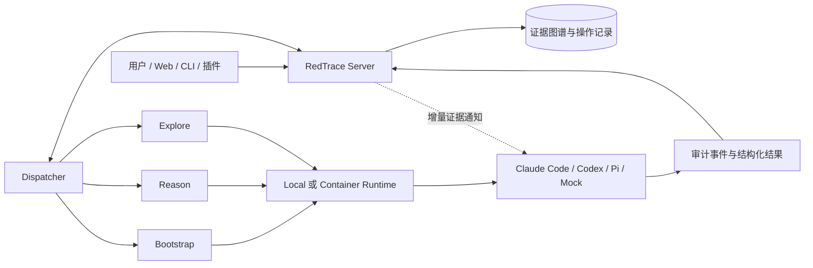

# RedTrace

RedTrace 是一个面向授权安全研究、代码审计与复杂技术调查的多 Agent 协同平台。它把目标、已验证证据、待验证方向和人工提示组织成持续演进的证据图谱，再由独立 Dispatcher 将工作分配给 Claude Code、Codex、Pi 或 Mock Worker。

RedTrace 关注的不是一次对话能否给出答案，而是一个长任务能否被并行推进、持续校正、失败恢复并完整审计。每次执行都有明确输入、结构化输出、运行记录和 Workspace；新的可靠结论会进入共享证据面，供正在运行的其他 Worker 在关键决策点增量获取。

> RedTrace 仅用于获得明确授权的安全测试、研究、竞赛和实验环境。项目提供执行与审计基础设施，不代表对任何目标的访问授权。

## 核心能力

- **Trace Loop 任务闭环**：通过 `bootstrap → reason → explore` 循环完成初始突破、全局判断和并行验证，直到目标完成、人工停止或暂时没有可执行方向。
- **证据图谱**：用 `Project`、`Fact`、`Intent`、`Hint` 区分目标、事实、调查方向和人工输入，避免把模型的临时推测当成结论。
- **异构 Worker 协同**：统一接入 Claude Code、Codex、Pi 和 Mock，同时保留各 CLI 的会话、模型、Skill、MCP 与原生工具能力。
- **运行中知识同步**：证据修订会通过增量通知和 Worker 原生双向协议送达正在运行的任务；Worker 也可以通过只读 CLI 按需查询快照、变化、来源和局部上下文。
- **双运行后端**：Local 模式直接复用宿主机 Agent CLI；Container 模式为每个项目提供独立 Linux 执行环境和持久 Workspace。
- **上下文预算治理**：Context Harness 对大文件、HTTP 输出和安全工具结果进行有预算的摘要、索引和增量读取，完整原始数据保留在任务工件中。
- **资源与操作面**：统一管理 WebShell、C2 Listener、Session、Payload、外部插件和操作结果；高风险操作可进入审批流程，结果可选择发布为新证据。
- **可观测与可恢复**：任务、会话、工具事件、输出、心跳、超时、取消和资源操作均可审计；Server 或 Dispatcher 重启后可以恢复未完成状态。
- **Web 控制台与插件接入**：内置项目图谱、运行记录、Workspace、Worker 与能力管理界面，并提供浏览器扩展、Burp Suite 和兼容插件 API。

## 工作方式



一次典型任务会经历：

1. 用户创建 Project，提供起点、目标、约束和可选 Hint。
2. `bootstrap` 尝试直接取得关键证据或完成目标。
3. `reason` 读取当前证据图谱，判断是否已经完成；若未完成，则创建新的 Intent。
4. 一个或多个 `explore` Worker 认领 Intent，并行执行验证。
5. 通过验证的结果写为 Fact，Intent 被收束，随后进入下一轮 `reason`。
6. 目标满足后项目标记为 completed；失败、超时或取消则按任务协议回收或恢复。

详细设计见 [技术架构与调度设计](docs/specs/dispatcher-design.md)。

## 为什么选择 RedTrace

### 从“对话历史”转向“可验证证据”

模型对话适合思考，但不适合作为多人协同的唯一状态。RedTrace 将可复用结论写入证据图谱，把待验证方向单独建模，并保留每条结果的任务、会话和审计来源。后续 Worker 可以从稳定的共享事实继续工作，而不必反复重读完整对话。

### 并行而不失控

Dispatcher 同时约束全局并发、活动项目数、单项目并发和单 Worker 配额。任务派发还会考虑 Worker 能力、健康状态、优先级、当前负载和失败冷却窗口，从而让多个模型与多个项目共享资源时保持可预测性。

### 长任务中的实时协同

正在运行的 Worker 不必等到下一次任务启动才看到新证据。RedTrace 会监视证据修订，通过 Claude Code、Codex 和 Pi 的原生双向协议发送精简更新；完整内容继续按需读取，避免无边界地扩张 Prompt。

### 执行面可替换，控制面保持稳定

Server 负责协议与持久状态，Dispatcher 负责调度与生命周期，Runtime 负责进程和隔离，Worker Adapter 负责供应商差异。切换模型、CLI 或执行后端时，项目协议和审计结构无需随之重写。

## 快速开始

### 环境要求

- Python 3.12 或更高版本
- [`uv`](https://docs.astral.sh/uv/) 作为推荐的 Python 包与运行工具
- Local 模式需要已安装并登录至少一个 Agent CLI：`claude`、`codex` 或 `pi`
- Container 模式需要 Docker Engine 或 Docker Desktop，并使用 Linux containers

Windows 用户建议在 WSL2 中克隆和运行项目，以获得一致的 Bash、文件权限和路径语义。

### 一键部署（Linux / macOS / WSL）

```bash
git clone https://github.com/0X6C7879/RedTrace.git
cd RedTrace
BRAVE_API_KEY="replace-me" bash deploy.sh
```

`deploy.sh` 会检测 Linux 或 macOS，准备 Python 环境、Agent CLI、Playwright/Chromium、共享 Skill 和必要工具。Linux 支持 APT、DNF/YUM、Pacman、Zypper 与 APK；也可以只检查安全工具链计划：

```bash
bash install-security-toolchain.sh --dry-run apt
```

### Local 模式

Local 模式直接调用当前用户已经安装和登录的 Agent CLI，不要求 Docker：

```bash
cp redtrace.local.example.yaml redtrace.yaml

# 终端 1：控制面
REDTRACE_DISPATCH_CONFIG="$PWD/redtrace.yaml" \
  uv run --project redtrace redtrace serve

# 终端 2：调度器
uv run --project redtrace redtrace dispatch --config redtrace.yaml
```

也可以用统一启动脚本同时管理两个进程：

```bash
./start-redtrace.sh
```

Local Worker 继承启动 Dispatcher 的用户权限和宿主机环境，不额外提供沙箱。请只在已隔离且获得授权的环境中使用。

### Docker Compose 模式

```bash
cp redtrace.container.example.yaml redtrace.yaml
docker compose up --build
```

Compose 会构建 RedTrace 控制面和 Worker 镜像。Container Runtime 默认按项目创建独立容器，并挂载共享能力目录与项目 Workspace。

如需使用其他配置文件：

```bash
REDTRACE_CONFIG_FILE=./redtrace.container.example.yaml docker compose up --build
```

启动完成后访问 <http://127.0.0.1:8000>。

### Mock 模式

Mock Worker 用于协议开发、调度回归和确定性端到端测试，不调用外部模型：

```bash
cp redtrace.mock.example.yaml redtrace.yaml
uv run --project redtrace redtrace serve
uv run --project redtrace redtrace dispatch --config redtrace.yaml
```

## 配置概览

三个可直接复制的配置模板：

| 文件 | 用途 |
|---|---|
| `redtrace.local.example.yaml` | 宿主机直接运行 Claude Code、Codex 或 Pi |
| `redtrace.container.example.yaml` | Docker/Compose 与项目级容器隔离 |
| `redtrace.mock.example.yaml` | 无外部模型的开发和自动化测试 |

关键配置域：

| 配置域 | 说明 |
|---|---|
| `runtime` | 执行后端、全局/项目并发、调度周期、健康检查和 Prompt 组 |
| `tasks` | Bootstrap、Reason、Explore 的主阶段与收尾超时，及 Intent 上限 |
| `context_harness` | 工件目录、内联/可见/查询/解析预算与 Worker 输出上限 |
| `container` / `local` | 容器镜像、网络、完成策略或本地 Workspace 根目录 |
| `workers` | 类型、启用状态、任务能力、优先级、并发和供应商环境变量 |
| `paths` | Skills、MCP、Plugins、托管状态、Workspace 与审计目录 |

Dispatcher 支持配置快照与安全热加载：新任务使用新配置，已经运行的任务继续使用启动时快照。Web 设置页可创建、复制、启停和测试 Worker；写入使用 revision 做乐观并发控制，API Key 不会在查询响应中回显。

运行数据只写当前项目：`.redtrace/` 保存数据库、日志、锁和共享运行时，`workspaces/<project_id>/` 保存 Worker 会话、提示与工件，`output/webshell/` 和 `output/c2/` 保存人工审计需要长期保留的落地结果。删除工作台任务会删除对应 Workspace 和任务对话，并物理压缩数据库；WebShell/C2 资产及其操作记录继续保留。

## 常用命令

### 主程序

```bash
redtrace serve --host 127.0.0.1 --port 8000
redtrace dispatch --config redtrace.yaml
redtrace dispatch --config redtrace.yaml --once
redtrace dispatch --config redtrace.yaml --startup-healthcheck-only
```

### 增量证据查询

`redtrace-blackboard` 是代码中保留的兼容入口名，实际承担只读证据查询职责：

```bash
redtrace-blackboard status
redtrace-blackboard snapshot
redtrace-blackboard changes --since 42 --limit 20
redtrace-blackboard node f003
redtrace-blackboard source f003
redtrace-blackboard context f003 --depth 1 --limit 30
```

### 共享资源与操作

```bash
redtrace-resource capabilities
redtrace-resource snapshot --kind webshell --kind c2_listener --kind c2_session
redtrace-resource changes --since 42

redtrace-resource webshell-create \
  --name primary --target https://target.example/shell.php \
  --command-param cmd --password-stdin
redtrace-resource run ws_123 command --command-text id --wait

# Listener 与资源本身是全局的；--project/REDTRACE_PROJECT_ID 只记录来源
redtrace-resource listener-create --name reverse-01 \
  --listener-type tcp_reverse --bind-host 0.0.0.0 --bind-port 4444
redtrace-resource listener-create --name bind-01 \
  --listener-type tcp_bind --target-host 10.0.0.8 --bind-port 4444
redtrace-resource session-register --name dc01-winrm --target 10.0.0.8 \
  --shell-type evil_winrm --connection-type direct --credential cred_123
printf '%s' "$SECRET_JSON" | redtrace-resource credential-create \
  --name 'DOMAIN\\alice' --credential-type active_directory --target dc01 --secret-stdin
redtrace-resource payload-import --name custom-loader --target artifact://payload.exe \
  --framework custom --format exe
```

MSF、Sliver、Cobalt Strike 与自定义 C2 通过同一个 Adapter 合约接入：RedTrace
轮询 `GET /sessions?framework=...`，向 `POST /execute` 发送会话动作，并向
`POST /payloads` 请求原生 Payload。Adapter 返回的会话会自动进入全局 C2 会话页；
Worker 生成的任意文件或引用可直接用 `payload-import` 登记，不要求使用内置生成器。

### Workspace 上下文

```bash
redtrace-context --help
```

Context Harness 会把完整输出保存到 `.redtrace/artifacts/context`，同时向 Worker 提供有界摘要和可追溯引用。

## 仓库结构

| 路径 | 内容 |
|---|---|
| `redtrace/src/redtrace/server/` | FastAPI 控制面、SQLite、REST/SSE、静态 Web UI |
| `redtrace/src/redtrace/dispatcher/` | 配置、调度循环、任务编排、运行时与 Worker Adapter |
| `redtrace/src/redtrace/board/` | Project、Fact、Intent、Hint 的领域模型与存储访问 |
| `redtrace/src/redtrace/capabilities.py` | Skill/MCP 能力发现、启停、版本与 Workspace 物化 |
| `redtrace/src/redtrace/worker_config.py` | Worker 配置服务、连接测试和原生 CLI 配置同步 |
| `skills/` | 多 Worker 共享的一级原生 Skill；由 Claude/Codex/Pi 按需直接加载 |
| `mcp/` | 共享 MCP 配置与服务入口 |
| `plugins/` | 外部插件清单、浏览器扩展和 Burp Suite 扩展 |
| `container/` | Worker 容器镜像与运行资产 |
| `.redtrace/` | 项目级数据库、日志、锁和内部运行状态（不提交） |
| `workspaces/` | 按任务隔离的 Worker 会话、提示、临时文件和工件（不提交） |
| `output/webshell/`、`output/c2/` | 供人工审计的 WebShell/C2 落地文件（不提交） |
| `docs/` | 协议、架构、上下文和插件兼容文档 |

## 验证与测试

```bash
uv sync --project redtrace --locked --group dev
uv run --project redtrace pytest -q
docker compose config -q
```

测试套件覆盖 Server API、数据库迁移、调度策略、任务协议、Worker Adapter、实时控制、本地与容器运行时、项目删除、能力管理、上下文工件、部署脚本和 Mock 端到端流程。

## 安全边界

- Local 模式以当前用户权限运行 Agent CLI，没有额外沙箱。
- Container 模式提供项目级文件与进程边界，但网络能力和 Linux capabilities 仍应按最小权限配置。
- 对外监听 Server 或插件 API 时，应配置访问令牌并限制网络暴露。
- API Key 与其他敏感配置应通过 RedTrace 的密钥存储或环境变量提供，不要提交到仓库。
- WebShell、C2 和外部插件操作只应指向明确授权的目标；高风险动作建议启用人工审批。

## 进一步阅读

- [技术架构与调度设计](docs/specs/dispatcher-design.md)
- [Server 协议](docs/specs/server-protocol.md)
- [Context Harness](docs/specs/context-harness.md)
- [插件兼容协议](docs/specs/plugin-compatibility.md)
- [增量证据查询 CLI](docs/shared-blackboard-cli.md)

## 许可证

本项目基于 **GNU AGPLv3** 许可证发布。商业授权请联系项目维护者。
