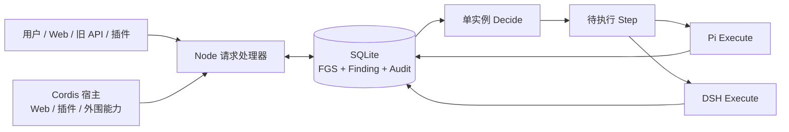

# RedTrace

RedTrace 是一个面向授权安全研究、代码审计与复杂技术调查的本地 Agent 系统。Node 内核把目标、事实、待执行步骤和成果组织为唯一的 FGS 图，再把工作分配给声明了各自模型、资格与并发上限的 Worker。

RedTrace 关注的不是一次对话能否给出答案，而是一个长任务能否被并行推进、持续校正、失败恢复并完整审计。每次执行都有明确输入、结构化输出、运行记录和 Workspace；新的可靠结论会进入共享证据面，供正在运行的其他 Worker 在关键决策点增量获取。

> RedTrace 仅用于获得明确授权的安全测试、研究、竞赛和实验环境。项目提供执行与审计基础设施，不代表对任何目标的访问授权。

## 核心能力

- **Decide / Execute 闭环**：每个项目最多一个无私有会话的 Decide；多个 Execute 可并行推进 Step，任一事实提交都会立即唤醒下一轮规划。
- **唯一 FGS 图**：`Fact` 保存有来源的事实，`Goal` 保存完成条件和子目标，`Step` 保存行动与状态，`Finding` 保存可交付成果。`Hint` 与 `Observation` 保持人工输入和中间记录语义。
- **异构 Worker 协同（Worker 即路由）**：任意数量 Worker 各自声明 Provider、模型、任务资格（bootstrap/reason/explore）、并发与优先级。调度器按资格、容量、优先级与负载公平性选择 Worker，并用该 Worker 的模型配置创建任务——路由完全由 Worker 派生，而非按任务类型写死。
- **Node 24 Agent 运行时**：轻量任务直接使用 Pi Agent；需要旧钩子的任务使用 DSH 适配器。两者共享一个 FGS 调度器，Cordis 插件仍运行在真实 Cordis 服务和生命周期中。
- **运行中知识同步**：证据图谱修订会通过 `agent.inject()` 增量送达正在运行的 Agent；共享 Resource 摘要随上下文注入，完整信息按需查询。
- **上下文预算治理**：DSH 原生 Session Compaction、Tool Result Pruner 与 Spill 控制上下文压力，Graph 按需注入而不是无限堆进 Prompt；超大工具结果完整落盘、按需取回。
- **DSH 原生执行工具链**：Execute Worker 直接获得 DSH 原生能力——`web_search` / `web_fetch`、后台任务（`job_output` / `job_list` / `job_kill`，bash `run_in_background`）、持久 PTY 终端、`glob` / `grep`、工具超时与重复调用防护；LSP 代码导航与 `run_code` 程序化调用按需开启。全部在插件管理页热启停，仅对新会话生效，不自研重复 Skill/MCP。
- **资源与操作面**：统一管理 WebShell、C2 Listener、Session、Payload、凭证、外部插件和操作结果；MSF、Sliver、Cobalt Strike 与自定义 C2 通过同一个 Adapter 合约接入。Resource 保留可变运行状态，不会隐式生成 Fact。
- **可观测与可恢复**：任务、会话、工具事件、输出、心跳、超时、取消和资源操作均可审计，Token 用量按运行累计汇总；Server 或运行时重启后可以恢复未完成状态。
- **Web 控制台与插件接入**：内置证据图谱可视化、运行记录、Workspace、Skill 与 MCP 管理、Worker 设置、插件管理页，并提供浏览器扩展、Burp Suite 和兼容插件 API。

## 工作方式

系统分为三层：**内核**是 TypeScript + Node 24 + 内置 SQLite，负责 FGS、事务、调度、审计与配置；**执行面**按 Worker 选择 Pi 或 DSH Agent，并保持 Step 独立会话；**能力层**由 Cordis 插件、Skill、MCP、Resource、浏览器与安全工具组成，按任务装载。


```mermaid
flowchart LR
    U[用户 / Web / 旧 API / 插件] --> N[Node 请求处理器]
    N <--> DB[(SQLite<br/>FGS + Finding + Audit)]
    DB --> D[单实例 Decide]
    D --> S[待执行 Step]
    S --> E1[Pi Execute]
    S --> E2[DSH Execute]
    E1 --> DB
    E2 --> DB
    C[Cordis 宿主<br/>Web / 插件 / 外围能力] --> N
```

一次典型任务会经历：

1. 用户创建 Project，提供 Origin、根 Goal 与可选 Hint。
2. Decide 读取当前任务图，完成 Goal 或生成关联 Fact、Goal 与优先级的 Step；Bootstrap 只是首轮 Step 策略。
3. 调度器按模型、资格与并发限制原子领取 Step；Pi 或 DSH Execute 在独立会话中执行。
4. Execute 可持续提交 Fact 和 Finding；事务提交后直接唤醒 Decide 与界面，无需 HTTP 认领轮询。
5. Stop 保存活动检查点；恢复沿用同一 Step 会话。崩溃后保留已提交事实，结果未知的外部操作不会自动重放。
6. Goal 满足后项目完成；旧 Intent/Reason/Explore API 只投影到这张图，不维护第二套状态。

详细设计见 [技术架构与调度设计](docs/specs/dispatcher-design.md)。

## 为什么选择 RedTrace

### 从“对话历史”转向“可验证证据”

模型对话适合思考，但不适合作为多人协同的唯一状态。RedTrace 将可复用结论写入证据图谱，把待验证方向单独建模，并保留每条结果的任务、会话和审计来源。后续 Worker 可以从稳定的共享事实继续工作，而不必反复重读完整对话。

### 并行而不失控

调度同时约束全局并发、活动项目数、单项目并发和单 Worker 配额。任务派发还会考虑 Worker 能力、健康状态、优先级、当前负载和失败冷却窗口，从而让多个模型与多个项目共享资源时保持可预测性。

### 长任务中的实时协同

正在运行的 Worker 不必等到下一次任务启动才看到新证据。RedTrace 会监视证据修订，通过运行时的原生注入通道发送精简更新；完整内容继续按需读取，避免无边界地扩张 Prompt。

### 一个内核，多种执行适配器

FGS Store 负责唯一持久状态，Scheduler 只领取 Step 和分配配额，执行适配器负责模型会话与工具。Pi 与 DSH 不复制任务图；旧 API、Cordis 插件和外围能力都调用同一组 Node 存储函数。

## 快速开始

### 环境要求

- Node.js 24.15 或更高版本，且保持在 Node 24 LTS 主版本
- npm（仅首次安装锁定的 Node 依赖时使用）
- 一个 OpenAI 兼容或 Anthropic 兼容的模型 API 端点与密钥

Windows、macOS 和 Linux 均可原生运行，无需 Docker 与 WSL。

### 一键部署（Linux / macOS / WSL）

```bash
git clone https://github.com/0X6C7879/RedTrace.git
cd RedTrace
bash deploy.sh
```

`deploy.sh` 会检测 Linux 或 macOS，准备 Node、Playwright/Chromium、共享 Skill 和可选安全工具链。Linux 支持 APT、DNF/YUM、Pacman、Zypper 与 APK；也可以只检查安全工具链计划：

```bash
bash install-security-toolchain.sh --dry-run apt
```

### 一键启动（Windows / macOS / Linux）

Windows 先在 PowerShell 中复制配置，然后可双击 `start-redtrace.cmd`，也可在终端启动：

```powershell
Copy-Item redtrace.local.example.yaml redtrace.yaml
.\start-redtrace.cmd
```

macOS、Linux 或 WSL：

```bash
cp redtrace.local.example.yaml redtrace.yaml
./start-redtrace.sh
```

复制后编辑 `redtrace.yaml`：填入 `providers.<name>.api_key`，按需调整 `workers`。两个入口首次运行会执行锁定的 npm 安装并构建 Cordis 兼容运行时，之后直接启动。它们接受 `--config`、`--host` 和 `--port`；`Ctrl+C` 会停止本次 Node 进程。用户调用的 Python 安全工具仍可作为外部工具使用，RedTrace 自身不依赖 Python。

### 运行时模型

启动后只有一个 Node 进程：Cordis Web 服务直接调用 Node 请求处理器并提供 Web UI（默认 `http://127.0.0.1:8000`），没有 FastAPI 反代。`mock` Worker 走进程内确定性执行器，用于开发、持久化测试和性能对照。

Worker 即路由：每个 Worker 独立声明 `provider`、`model`、`bootstrap/reason/explore` 资格、`max_running` 并发与 `priority`；调度器按资格、容量、优先级与负载公平性选择 Worker，并用该 Worker 的模型配置创建任务。Worker 修改后对新任务自动生效，无需重启——设置页与直改配置文件都走同一条热加载链路，任何配置变更都不要求重启进程。

Agent 继承启动用户的宿主机权限；isolated 执行 profile 可按 Intent 启用沙箱。请只在已隔离且获得授权的环境中使用。

### Docker Compose 模式

```bash
cp redtrace.local.example.yaml redtrace.yaml
docker compose up --build
```

Compose 会构建单进程 Node 服务。Node 容器直接运行 FGS 调度器、Cordis Web 宿主与执行器，并挂载共享能力目录、运行数据目录和项目 Workspace。

如需使用其他配置文件：

```bash
REDTRACE_CONFIG_FILE=./redtrace.mock.example.yaml docker compose up --build
```

启动完成后访问 <http://127.0.0.1:8000>。

### Mock 模式

Mock Worker 用于协议开发、调度回归和确定性端到端测试，不调用外部模型：

```bash
cp redtrace.mock.example.yaml redtrace.yaml
./start-redtrace.sh --config redtrace.yaml --mock
# Windows: start-redtrace.cmd --config redtrace.yaml --mock
```

## 配置概览

两个可直接复制的配置模板：

| 文件 | 用途 |
|---|---|
| `redtrace.local.example.yaml` | 宿主机直跑 Worker |
| `redtrace.mock.example.yaml` | 无外部模型的开发和自动化测试 |

关键配置域：

| 配置域 | 说明 |
|---|---|
| `providers` | API 协议（OpenAI/Anthropic 兼容）、endpoint、密钥与模型列表（context window、max tokens、reasoning 策略） |
| `workers` | 模型路由、启用状态、任务资格、优先级和并发 |
| `runtime` | 全局/项目并发限制 |
| `tasks` | Bootstrap、Reason、Explore 的主阶段与收尾超时，及 Intent 上限 |
| `common_env` | 传递给 Worker 的环境变量 |

配置支持快照与热加载：新任务使用新配置，已经运行的任务继续使用启动时快照。Web 设置页可创建、复制、启停和测试 Worker；写入使用 revision 做乐观并发控制，API Key 不会在查询响应中回显。

运行数据只写当前项目：`.redtrace/` 保存数据库、日志、锁和共享运行时，`workspaces/<project_id>/` 保存 Worker 会话、提示与工件，`output/webshell/` 和 `output/c2/` 保存人工审计需要长期保留的落地结果。删除工作台任务会删除对应 Workspace 和任务对话，并物理压缩数据库；WebShell/C2 资产及其操作记录继续保留。

## 常用命令

### 主程序

```bash
./start-redtrace.sh --config redtrace.yaml --host 127.0.0.1 --port 8000
# Windows: start-redtrace.cmd --config redtrace.yaml --host 127.0.0.1 --port 8000
```

### DSH 运行时构建与测试

```bash
npm run dsh:install        # 安装 vendored DSH 运行时依赖
npm run dsh:update         # 更新到上游最新发布版本（包含 RC），保留本地补丁并构建验证
npm run dsh:build          # 构建上游 + RedTrace DSH 扩展包
npm run dsh:test           # 运行 TypeScript 侧测试
```

Web 控制台的「设置 → DSH 运行时」提供检查更新和更新按钮。更新使用上游发布版本（包含预发布版），保留 `scripts/dsh-local.patch` 中的定制补丁；先在独立目录安装、构建并通过测试和启动检查，再替换运行时。Web 更新要求 Worker 空闲，成功后暂停新任务，重启 RedTrace 才会生效。失败保留当前版本，成功时旧版本备份在 `.redtrace/dsh-updates/`。直接修改过 DSH 源码时会拒绝覆盖，需先将改动维护到补丁中。独立运行目录（如 WSL 源码与运行时分离）请通过命令更新后重新部署。

### 共享资源与能力动词

资源（WebShell、C2 Listener/Session/Payload、凭证、流量伪装 Profile、代理、文件）由引擎统一登记，人机共用。Web UI 的运维页提供全量管理与审批；Worker 侧通过工具访问：通用的 `resource_register` / `resource_list` / `resource_get`（`resource_register` 支持 secret 存储但不回显），以及 WebShell / C2 通道族的富表单工具（`webshell_register`、`c2_listener_create`、`c2_session_create`、`c2_credential_create`、`c2_profile_create`、payload 生成与 `c2_sessions`）。Explore 在任务中建立的通道、凭证与 payload 都会出现在对应运维页面上。

Step 在创建时用 `requires` 声明能力动词（`remote.command`、`remote.file.read` 等）后，Execute 会话只获得对应的动词工具；派发器自动复用已注册的可用通道（按 target 主机匹配，或 `via` 显式指定），无可用通道时返回建立指引。`GET /capabilities/verbs` 列出全部动词、适配器与通道计数，插件页的 WebShell / C2 插件可热启停对应通道族。

MSF、Sliver、Cobalt Strike 与自定义 C2 通过同一个 Adapter 合约接入：RedTrace 轮询 `GET /sessions?framework=...`，向 `POST /execute` 发送会话动作，并向 `POST /payloads` 请求原生 Payload。Adapter 返回的会话自动进入全局 C2 会话页。

## 仓库结构

| 路径 | 内容 |
|---|---|
| `packages/redtrace-engine/` | Node FGS 存储、Decide/Execute 调度、REST/SSE、配置、审计与外围能力 |
| `packages/redtrace-dsh/` | 引擎宿主的 Cordis 适配插件包：插件管理、资源工具、执行工具链、审计投影与引擎调度器生命周期 |
| `vendor/deepseek-harness/` | DSH/Cordis 运行时（vendored，通过设置页或 dsh:update 手动更新） |
| `profiles/redtrace/` | Cordis 运行时组装配置（node 单入口） |
| `static/` | Web UI 静态资源（HTML/JS/CSS/字体/图表库） |
| `skills/` | 多 Worker 共享的一级原生 Skill；由 Agent 按需直接加载 |
| `mcp/` | 共享 MCP 配置与服务入口 |
| `container/` | Worker 容器镜像与运行资产 |
| `scripts/` | 构建、启动与基准辅助脚本 |
| `.github/workflows/` | 三平台 CI（dsh-mainline） |
| `.redtrace/` | 项目级数据库、日志、锁和内部运行状态（不提交） |
| `workspaces/` | 按任务隔离的 Worker 会话、提示、临时文件和工件（不提交） |
| `output/webshell/`、`output/c2/` | 供人工审计的 WebShell/C2 落地文件（不提交） |
| `docs/` | 协议、架构和上下文文档 |

## 验证与测试

```bash
npm ci --prefix packages/redtrace-engine
npm run --prefix packages/redtrace-engine check
npm test --prefix packages/redtrace-engine
npm run dsh:test
docker compose config -q
```

Node 测试覆盖 FGS 事务、并发领取、事实触发规划、暂停恢复、旧 API 投影、配置密钥、外围能力、Cordis 生命周期、启动脚本和 Mock 端到端流程；DSH 扩展继续用 `node:test` 覆盖插件与旧 Agent 钩子。

CI 在 Windows、macOS 与 Ubuntu 三个平台上运行 Node 24.21：内核类型检查与测试 → DSH 构建、测试与探针 → 启动脚本冒烟。

## 安全边界

- 默认执行继承启动用户的宿主机权限，没有额外沙箱；isolated 执行 profile 可按 Intent 启用进程与文件系统沙箱。
- Container 模式提供项目级文件与进程边界，但网络能力和 Linux capabilities 仍应按最小权限配置。
- 对外监听 Server 时，应配置访问令牌并限制网络暴露。
- API Key 与其他敏感配置应通过 RedTrace 的密钥存储或环境变量提供，不要提交到仓库。
- WebShell 和 C2 操作只应指向明确授权的目标；高风险动作建议启用人工审批。

## 进一步阅读

- [Node FGS 运行时](docs/specs/node-fgs-runtime.md)
- [Capability Registry(动词能力体系)](docs/specs/capability-registry.md)
- [Server 协议](docs/specs/server-protocol.md)
- [Context Harness](docs/specs/context-harness.md)

## 许可证

本项目基于 **GNU AGPLv3** 许可证发布。商业授权请联系项目维护者。
