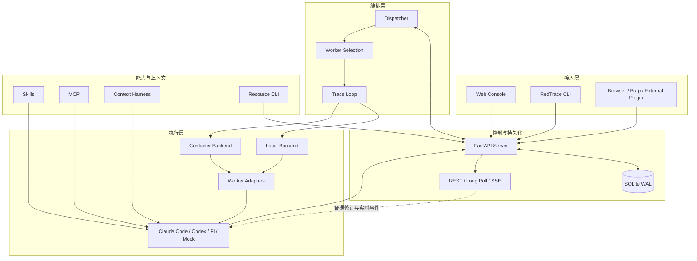
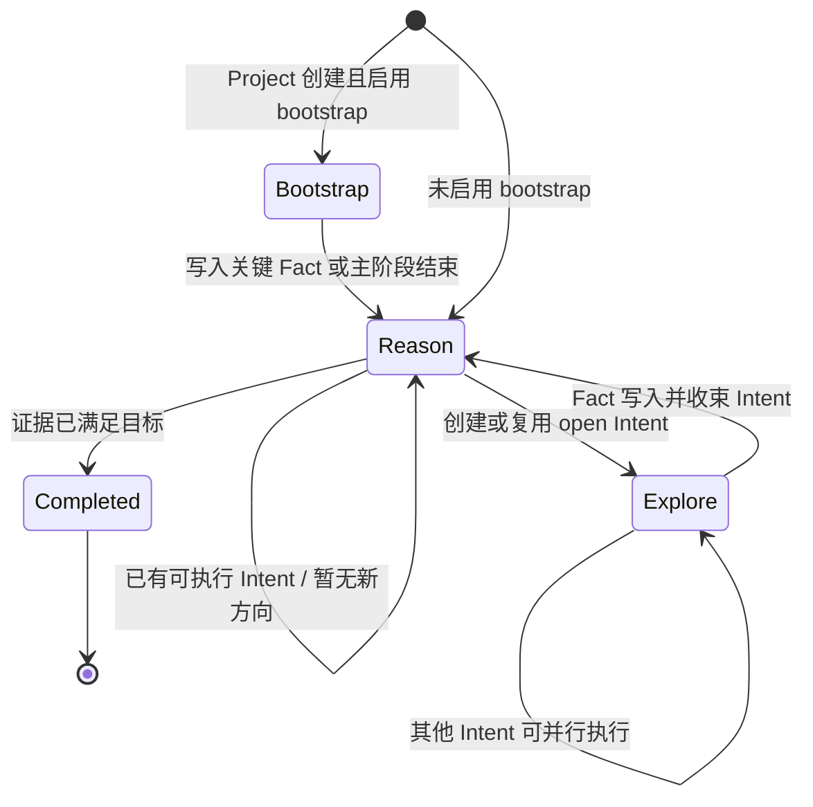

# RedTrace 技术架构与调度设计

本文档描述 RedTrace 0.3.x 当前代码的系统设计、运行链路、可靠性机制和技术优势。字段级 API 契约见 [Server 协议](server-protocol.md)，上下文处理细节见 [Context Harness](context-harness.md)，外部插件兼容层见 [插件兼容协议](plugin-compatibility.md)。

## 1. 设计目标

RedTrace 面向持续时间长、分支多、需要工具执行和证据复核的任务。系统设计围绕五个目标展开：

1. **结论可验证**：把目标、证据、调查方向和人工输入分开存储，每个结论都能追溯到执行任务与会话。
2. **协作可并行**：不同模型、不同 CLI 和不同项目共享一套调度协议，同时受全局与局部配额约束。
3. **执行可替换**：控制面不绑定某个模型供应商，也不绑定容器或本地进程。
4. **长任务可恢复**：认领、心跳、超时、取消、失败冷却和项目清理均有显式状态。
5. **过程可审计**：任务元数据、模型事件、工具调用、输出摘要、资源操作和 Workspace 均可查询与导出。

RedTrace 的核心抽象不是聊天线程，而是“证据驱动的执行闭环”。对话和工具输出是过程材料，只有通过任务契约提交的结果才进入共享证据面。

## 2. RedTrace 概念模型

### 2.1 证据图谱

| 对象 | 语义 | 主要约束 |
|---|---|---|
| `Project` | 顶层目标、起点、状态和调度边界 | `active`、`stopped`、`completed`，删除使用独立生命周期 |
| `Fact` | 已验证、可供后续任务复用的结论 | 追加式写入，带来源与创建者 |
| `Intent` | 从一个或多个 Fact 出发的待验证方向 | `open → claimed → concluded`，支持 heartbeat 与 release |
| `Hint` | 人工注入的约束、优先级或背景 | 不作为因果证据，但进入任务上下文 |

`Intent.from` 可以引用多个 Fact，因此图谱可以表达“多项证据共同支持下一步调查”的关系。Server 维护合法状态转换和单调递增的图谱修订号；Worker 不直接修改数据库，而是通过 Dispatcher 和控制面协议提交结果。

### 2.2 执行记录

证据图谱回答“目前知道什么”，执行记录回答“这些结论如何产生”。主要对象包括：

- `audit_runs`：项目、任务类型、阶段、Worker、Provider、Session、Workspace、开始/结束时间和终态。
- `audit_events`：模型消息、推理事件、工具调用、结果、错误和生命周期事件。
- `shared_resources`：WebShell、C2 Listener、C2 Session、Payload、插件和结果资源。
- `operation_tasks`：面向资源的异步操作、风险等级、审批、输入、结果引用和状态。
- Workspace 与 Context Artifact：完整执行现场、大输出原文、摘要索引和可增量读取工件。

证据与执行记录互相引用，但职责不同。这样既能给 Worker 一个精简、稳定的决策输入，也能给人类保留足够的复盘材料。

## 3. 总体架构



### 3.1 控制面：Server

`redtrace.server.app` 创建 FastAPI 应用并注册 Project、Intent、Hint、Evidence Query、Audit、Operation、Capability、Worker 和 Plugin 路由。启动阶段会：

1. 配置并迁移 SQLite 数据库；
2. 启用 WAL 与连接级约束；
3. 恢复仍处于 queued 的可恢复操作任务；
4. 挂载静态 Web 控制台。

Server 不启动 Agent 进程，也不承担任务选择。它负责：

- 领域状态与状态转换；
- Intent/Reason 的互斥认领和租约；
- 证据修订、增量变化和等待通知；
- Worker 配置的验证、版本冲突检测与密钥处理；
- 审计事件持久化与 SSE 分发；
- 共享资源、审批和异步操作；
- 项目停止、恢复、完成和删除流程。

这种边界让 Web、CLI、插件和 Dispatcher 共享同一套一致性协议。

### 3.2 编排面：Dispatcher

Dispatcher 是长运行的控制面客户端，核心实现位于 `redtrace.dispatcher.scheduler.loop.Dispatcher`。它持有：

- Server API 客户端与线程本地 HTTP Session；
- Worker 与 Runtime 配置快照；
- 全局线程池和运行任务表；
- 每个 Worker、每个项目的并发计数；
- 不健康、拒绝和失败后的本地冷却窗口；
- 容器或本地 Workspace 生命周期；
- 配置热加载器和结构化日志状态。

Dispatcher 使用“变化通知 + 周期节拍”的混合循环。Server 有状态变化时可提前唤醒，固定 `runtime.interval` 则提供心跳、回收和容错节拍。这样既避免高频空轮询，也不会把系统正确性依赖在单次通知上。

### 3.3 执行面：Runtime

Runtime 对任务编排暴露统一进程接口：

```text
start → stream output / send stdin → communicate → cancel or finish
```

两种实现共享超时、取消、输出边界和审计语义：

- **Local Backend**：在宿主机项目 Workspace 内启动 Agent CLI，继承宿主环境，再用 `common_env` 和 `worker.env` 覆盖；适合已有本地登录态和工具链的开发环境。
- **Container Backend**：按 Project 管理 `redtrace-dispatch-*` 容器，提供统一 Linux Workspace、共享能力挂载和完成/删除清理策略；适合隔离要求更高或工具依赖复杂的任务。

Runtime 会保留 stdout/stderr 总字节数、截断状态、退出码、超时和取消原因。大输出由有界缓冲与 Context Harness 共同治理，避免单个工具输出耗尽内存或 Prompt 预算。

### 3.4 适配面：Worker Driver

每种 Worker 通过 `WorkerDriver` 实现以下能力：

- 健康检查与可读诊断；
- 构造主阶段命令；
- 构造同会话 `conclude` 收尾命令；
- 准备、提取和恢复 Session；
- 从供应商输出中提取最终响应；
- 可选的原生实时控制协议。

当前类型：

| `type` | 执行入口 | 特点 |
|---|---|---|
| `claudecode` | Claude Code CLI | stream-json 会话、原生 Skill/Plugin 能力、可实时追加用户消息 |
| `codex` | Codex app-server | JSON-RPC 风格线程/Turn 协议、输出 Schema、运行中 `turn/steer` |
| `pi` | Pi RPC | 轻量会话、`steer` 控制与共享 Skill |
| `mock` | 内置测试 Driver | 可配置延迟与结果分布，用于协议和调度回归 |

Provider 差异被限制在 Adapter 层，任务编排只依赖统一的 `DriverResult`、`ProcessResult` 与结构化输出契约。

## 4. Trace Loop

Trace Loop 是 RedTrace 的任务推进算法，由三类任务组成。



### 4.1 Bootstrap

Bootstrap 是项目级初始推进任务，适合从 Origin 与 Goal 直接获得首个关键结论。

- 输入：Origin、Goal、Hints、初始证据快照、共享能力说明。
- 输出：Fact，可选 Complete；也可以明确拒绝。
- 运行：先完成项目级 claim，再启动 Worker。
- 容错：主阶段超时、输出不可解析或结果不完整但已有 Session 时，可进入有界 `bootstrap_conclude`，只总结已确认内容。

Bootstrap 不负责长期规划。其价值是降低简单任务的启动开销，并为复杂任务尽快建立第一批可靠证据。

### 4.2 Reason

Reason 是短时全局判断任务，负责：

1. 判断当前 Fact 是否已经满足 Goal；
2. 若未满足，判断是否需要创建新 Intent；
3. 单次 Reason 最多提出 `tasks.reason.max_intents` 个新 Intent；
4. 在已有足够工作时返回空操作，避免重复分支。

Reason 使用项目级租约，避免多个 Reason 同时产生冲突方向。`planning_revision` 只在 Fact 或 Hint 变化时递增；Reason 即使返回 No-op 也会持久化 `reason_evaluated_revision`。claim、heartbeat、last-seen 和并发槽位变化不会触发重新规划。

Reason 只能修改尚未认领的 ready Intent；working Intent 在执行期间只读。其输出只能是 Complete、Intent、No-op 或拒绝，不能直接伪造探索结果。

### 4.3 Explore

Explore 认领一个具体 Intent，执行工具调用、代码分析或环境验证，并提交客观结论。

- claim 成功后才占用 Worker 执行槽；
- 运行期间维持 Intent heartbeat；
- 可读取增量证据和共享资源；
- 成功结果成为 Fact，并收束当前 Intent；
- 主阶段失效但 Session 可继续时，进入 `explore_conclude`；
- 取消、项目停止或租约丢失时终止进程并安全释放状态。

同一项目可以并行执行多个 Explore，但它们共享项目 Workspace。会写同一批文件时，应把 `runtime.max_project_workers` 设为 `1`，或在任务设计中保证输出路径互不覆盖。

## 5. 调度算法

### 5.1 分层配额

Dispatcher 同时应用四层限制：

| 限制 | 配置 | 作用 |
|---|---|---|
| 全局任务数 | `runtime.max_workers` | 控制 Dispatcher 线程池和总执行量 |
| 活动项目数 | `runtime.max_running_projects` | 防止过多项目同时占用运行资源 |
| 单项目任务数 | `runtime.max_project_workers` | 防止单个项目垄断 Worker |
| 单 Worker 任务数 | `workers[].max_running` | 适配供应商配额和 CLI 并发能力 |

### 5.2 Worker 选择

`select_worker` 先过滤：

- `enabled: false`；
- `task_types` 不包含当前任务；
- 已达到 `max_running`；
- 仍处于健康检查失败冷却期；
- 当前项目/任务/Worker 组合仍处于拒绝冷却期。

剩余候选按以下顺序排序：

1. 完全空闲的 Worker 优先；
2. Explore 尽量避开上次未完成该方向的 Worker；
3. `priority` 数值更小者优先；
4. 当前运行数更少者优先；
5. 同层候选随机打散，避免固定热点。

选择结果同时记录 busy、unhealthy、rejected 和 task-type 不匹配的阻塞原因，便于日志诊断。

### 5.3 先认领、后提交

Bootstrap、Reason 和 Explore 都先通过 Server 完成原子认领，再向线程池提交任务。这样可以避免多个调度循环或意外启动的多个 Dispatcher 对同一工作重复执行。

项目并发与 Worker 并发只在认领成功后计数；任务结束、拒绝、取消或异常时统一释放。

## 6. 实时证据协同

### 6.1 修订与增量读取

SQLite 触发器为 Fact、Intent 和 Hint 的变化写入递增的 `blackboard_events.revision`。这里的 `blackboard` 是现有代码和兼容 API 的历史入口名；在 RedTrace 架构中，它对应只读的增量证据查询面。

Worker 可通过以下方式读取：

- `snapshot`：完整当前图谱；
- `changes --since <revision>`：分页增量变化；
- `node` / `source`：节点与证据来源；
- `path`：节点之间的有向路径；
- `context`：有深度和数量上限的局部上下文；
- `wait`：等待修订发生变化。

每次成功查询写入独立审计表，但查询不会改变证据内容。

### 6.2 运行中通知

任务启动时会记录当前图谱 revision，并在 Workspace 中准备精简通知文件。Heartbeat/Inbox 监视后续变化并生成差异摘要。

若 Worker 支持原生双向控制，Dispatcher 直接向当前会话发送更新：

- Claude Code：向 stream-json 会话追加 user message；
- Codex：等待 thread/turn 就绪后发送 `turn/steer`，就绪前最多保留最近的有限消息；
- Pi：通过 RPC `steer` 消息注入更新。

通知只携带决策所需的精简信息和引用，完整证据继续通过只读 CLI 按需读取。实时控制不可用时，通知文件与 CLI 仍构成稳定降级路径。

这一机制让并行 Worker 能及时利用新发现，同时避免把全量图谱反复拼接到 Prompt。

## 7. 输出契约与失败收束

所有 Agent 任务必须返回 JSON 对象，并包含：

```json
{
  "accepted": true,
  "data": {}
}
```

Dispatcher 会执行两层验证：

1. 通用层：输出必须是可解析 JSON，`accepted` 与 `data` 类型正确；
2. 任务层：Bootstrap、Reason、Explore 只接受各自允许的字段、ID 和状态组合。

`accepted: false` 表示 Worker 明确拒绝当前任务，不会被当作系统异常。非法 JSON、Schema 不匹配、命令失败、超时和接口写回失败会记录结构化原因，并通过冷却策略避免立即热循环。

Bootstrap 与 Explore 支持同会话 conclude 阶段。Conclude 不是第二次完整尝试，而是在更短预算内停止继续探索，只提取已经确认的事实。该设计能在模型超时或主输出损坏时保留有价值结果，同时限制额外成本。

## 8. 配置与热加载

Dispatcher 配置由 `LocalConfig` 解析，主要域包括：

- `server`：控制面地址；
- `runtime`：执行模式、并发、节拍、健康检查和 Prompt 组；
- `tasks`：三类任务超时与 Intent 上限；
- `context_harness`：上下文与输出预算；
- `container` 或 `local`：运行后端参数；
- `common_env`：所有 Worker 的公共环境；
- `workers`：能力、优先级、并发、模型和供应商配置；
- `paths`：能力、托管状态、Workspace 与审计路径。

路径相对于配置文件和 `paths.root` 解析，不依赖启动命令的当前目录。环境合并顺序为：

```text
宿主环境 < common_env < worker.env
```

配置文件发生原子替换后，Dispatcher 会校验并加载新快照。新任务使用新快照，运行中的任务保留旧快照，从而避免半途改变模型、超时或执行后端。

Web Worker 配置服务使用 SHA-256 revision 做乐观并发控制，支持创建、修改、复制、启停、删除与连接测试。Claude Code、Codex 和 Pi 的 Endpoint、API Key、Model ID 可同步到用户级原生 CLI 配置；查询 API 只返回密钥是否已配置，不返回明文。

## 9. 能力注入与 Context Harness

### 9.1 统一能力源

`paths.skills`、`paths.mcp` 和 `paths.plugins` 是 RedTrace 的能力目录：

- Skill 目录由 `CapabilityStore` 发现、启停、编辑和版本化；
- Worker 使用原生发现机制按任务加载最具体的专业 Skill；
- MCP 配置转换为各 Agent CLI 的原生参数或配置；
- 外部插件清单服务于浏览器、Burp 和其他接入端，不与 Agent Skill 混为一层。

`AgentRuntimeManager` 在 Dispatcher 启动和配置变化时准备运行资产。Claude Code 使用插件目录，Codex 使用 `skills.config`，Pi 使用原生扩展/Skill 参数。能力源保持统一，但适配结果符合各 CLI 的原生格式。

### 9.2 有预算上下文

Context Harness 在工具完整输出和模型可见上下文之间增加一层可追溯压缩：

- 小文本可直接内联；
- 结构化 Web/安全数据生成摘要与信号；
- 大文件先识别类型，再按预算解析；
- 完整原文写入 Workspace 工件；
- 后续任务通过引用、查询和增量快照复用；
- Worker stdout/stderr 使用前缀 + 尾部的有界保留策略。

这不是删除原始证据，而是把“保存完整现场”和“给模型多少内容”分开决策。

## 10. 资源与操作面

共享资源面让 Worker 不必在 Prompt 中传递敏感连接细节。典型流程：

1. 创建或发现资源元数据；
2. 敏感字段留在 Server 侧；
3. Worker 通过 `redtrace-resource` 请求一次操作；
4. Server 根据风险与审批状态排队；
5. `OperationExecutor` 执行 WebShell 或外部插件动作；
6. 完整结果写入结果资源，摘要进入任务记录；
7. `publish_result` 只创建结果 Resource；正式 Fact 仍由 Intent conclude 提交。

操作状态包含 queued、running、succeeded、failed、cancelled 和 rejected。Server 重启后可恢复仍可执行的 queued 任务，项目取消会传播到未完成操作。

## 11. 审计与可观测性

每次 Worker 运行都会创建稳定的 Run ID，并记录：

- Project、Intent、任务类型和阶段；
- Worker、Provider、Session ID；
- Workspace 类型、引用和根目录；
- 开始/结束时间、退出码、超时与取消标记；
- 模型消息、思考事件、工具事件和生命周期事件；
- 输出字节数、截断状态与结果解析情况。

高频 delta 事件可以只通过实时 Event Hub/SSE 分发，重要终态和消息持久化到 SQLite。这样控制台能显示实时进度，又不会让数据库被字符级流式事件淹没。

审计导出与 Workspace 浏览把“模型说了什么”“实际执行了什么”“最终写入了什么证据”串联起来，适合安全评估复盘和回归分析。

## 12. 恢复、取消与清理

### 12.1 租约与心跳

Intent 和 Reason 认领都带 Worker 身份与 heartbeat。Dispatcher 定期续租；Server 拒绝续租、项目状态变化或本地取消信号都会触发进程取消。

失联任务不会永久占用图谱状态。后续调度循环可以根据租约和 Server 当前状态进行释放或重新认领。

### 12.2 项目删除

删除采用持久化多阶段流程：

```text
标记 deleting
  → 取消调度任务与资源操作
  → 停止/删除项目 Runtime
  → 清理 Workspace、Prompt、会话与审计文件
  → 删除数据库关联记录
```

流程可在 Server 或 Dispatcher 重启后继续。某一阶段失败会保留错误状态供重试，重复删除保持幂等。共享 Skills、MCP、Plugins 和其他项目不受影响。

### 12.3 完成策略

- Container：`completed_action` 可为 `stop` 或 `remove`；
- Local：`completed_action` 可为 `keep` 或 `remove`；
- 删除与完成使用不同流程，避免“任务完成”意外销毁需要复盘的现场。

## 13. 安全设计

RedTrace 提供执行治理能力，但不会替代环境授权和网络边界。

### 13.1 最小暴露

- Server 默认绑定 `127.0.0.1`；
- 外部插件可使用 `REDTRACE_PLUGIN_TOKEN`；
- API Key 查询只返回配置状态；
- 敏感资源字段保存在 Server 侧，不写入 Worker Prompt；
- 操作可标记风险并要求人工审批。

### 13.2 运行权限

- Local 模式直接继承当前用户权限，没有额外沙箱；
- Container 模式隔离项目文件与进程，但 `network_mode`、挂载和 `cap_add` 必须按任务最小化；
- Codex/Claude/Pi 的本地执行参数可能关闭交互审批，以便无人值守运行，因此外层 WSL、容器或实验主机应承担明确隔离边界。

### 13.3 审计优先

任何自动化操作都应能回答：由哪个项目、哪个 Worker、哪个 Intent、哪次运行触发，使用了什么资源，产生了什么结果。RedTrace 的协议和数据表围绕这一追踪链设计。

## 14. 技术栈

| 层 | 技术 | 用途 |
|---|---|---|
| 语言与包管理 | Python 3.12+、uv | 控制面、调度器、CLI、可复现依赖 |
| Web/API | FastAPI、Pydantic、Uvicorn | REST、OpenAPI、SSE、请求/响应校验 |
| 持久化 | SQLite WAL | 单机可靠状态、事务、迁移和增量修订 |
| 并发 | ThreadPoolExecutor、threading | 调度任务、操作执行、心跳和流读取 |
| HTTP | requests、httpx（测试） | Dispatcher 控制面客户端与 API 测试 |
| 容器 | Docker SDK、Docker Compose | 项目级执行单元与部署 |
| 配置 | YAML、环境变量、原子替换 | 运行配置、Worker 配额和热加载 |
| 密钥 | cryptography | 本地敏感配置保护 |
| 前端 | FastAPI StaticFiles + 原生 Web 资产 | 轻量控制台，无独立前端构建链 |
| 测试 | pytest、Mock Worker | 单元、协议、运行时和端到端回归 |

## 15. RedTrace 的技术优势

### 15.1 决策状态与执行噪声解耦

共享决策输入只包含经过任务契约确认的 Fact、Intent 与 Hint；完整模型输出和工具噪声留在审计与工件层。图谱保持精简，现场仍可完整回放。

### 15.2 实时协同不是全量上下文广播

修订通知、原生会话 steer、通知文件和按需 CLI 形成分层同步机制。新证据能快速到达正在运行的 Worker，同时不会重复注入整份历史。

### 15.3 异构模型保持原生能力

统一的是任务协议和生命周期，不是把所有 Agent 降级成相同的文本接口。Claude Code、Codex 和 Pi 仍使用各自的 Session、Skill、MCP 和双向协议。

### 15.4 调度策略面向真实配额

全局、项目、Worker 三层并发加上能力过滤、健康冷却和负载排序，可以直接表达不同供应商 Key、模型吞吐和任务类型的现实限制。

### 15.5 失败有界，结果尽量保留

主阶段失败不会立即无限重试。系统优先用同会话 conclude 提取已经确认的内容，再通过冷却和下一轮 Reason 决定是否继续，降低成本和重复副作用。

### 15.6 Local 与 Container 共用同一协议

开发者可以先用本地 CLI 快速调试，再迁移到项目级容器；任务模型、证据写回、审计和调度配置无需重构。

### 15.7 控制面轻量且易于部署

FastAPI + SQLite WAL 足以支持单机多 Worker 调度，不要求额外数据库、消息队列或编排平台。需要更强隔离时再引入 Docker，而不是把基础开发流程绑定到复杂基础设施。

## 16. 测试策略

当前测试套件覆盖：

- 数据库初始化、迁移、WAL 和项目协议；
- Intent/Reason 认领、心跳、释放与冲突；
- Worker 选择、并发配额、冷却和调度边界；
- Bootstrap、Reason、Explore 与 conclude 输出契约；
- Claude Code、Codex、Pi、Mock Adapter 和实时控制；
- Local Process、Managed Process、容器生命周期与归档；
- Worker 配置、原生 CLI 配置同步和密钥脱敏；
- 增量证据查询、通知、来源和审计；
- Context Harness、Capability、Skill、MCP 与插件兼容；
- 资源操作、项目删除、部署脚本和 Mock 端到端流程。

推荐验证命令：

```bash
uv sync --project redtrace --locked --group dev
uv run --project redtrace pytest -q
python -m compileall -q redtrace/src
bash -n start-redtrace.sh deploy.sh install-security-toolchain.sh
docker compose config -q
```

Windows 上应在 WSL 中执行涉及 Bash、POSIX 可执行位和 Unix 路径的测试。

## 17. 已知边界与演进方向

- SQLite 架构针对单机控制面优化，不等同于分布式数据库或跨地域一致性方案。
- 多个 Explore 共享同一 Project Workspace，文件写冲突需要通过并发配置或任务约定规避。
- Container 模式的隔离强度取决于 Docker 网络、capabilities、挂载和宿主配置。
- 不同 Agent CLI 的实时协议可能随上游版本变化，Adapter 与健康检查需要持续回归。
- 增量证据面保留 `blackboard` 兼容路径；产品与文档层统一将其描述为证据查询与协同接口。
- 对外暴露 Server 时仍需要反向代理、TLS、网络 ACL 和更完整的身份体系。

这些边界被明确留在部署与适配层，不改变 RedTrace 的核心协议：证据可追溯、任务可认领、执行可替换、失败可恢复。
